title: 「AIを専門家に変える魔法」— KOTODAMA: Interactive Agentic Prompt 設計の全貌と実践ガイド

# 第1章 はじめに

## 1.1 従来のプロンプトの限界

ChatGPTやClaudeなどの大規模言語モデル（LLM）が普及し、多くの人がAIを活用するようになりました。しかし、こんな経験はないでしょうか？

- **的外れな回答**: 質問の意図を汲み取ってもらえない
- **浅い提案**: 一般論ばかりで、自分の状況に合った具体的なアドバイスが得られない
- **再質問の繰り返し**: 何度も追加情報を求められ、会話が冗長になる
- **専門性の欠如**: 理論的根拠のない、場当たり的な回答

これらの問題の根本原因は、**AIへの「指示の与え方」** にあります。

従来のプロンプトは、単発の指示を与える「コマンド型」が主流でした。

```
あなたは教育の専門家です。効果的な授業の作り方を教えてください。
```

このアプローチには致命的な欠陥があります。

| 問題点 | 説明 |
|--------|------|
| **文脈の欠如** | AIはユーザーの状況、制約、目標を知らない |
| **一方通行** | ユーザーが全ての必要情報を事前に整理する必要がある |
| **固定的な応答** | 同じプロンプトには同じような応答が返る |
| **理論的裏付けの不在** | なぜその提案なのか、根拠が示されない |

## 1.2 Interactive Agentic Prompt とは何か

**Interactive Agentic Prompt（IAP）** は、これらの限界を突破するために設計された、次世代のプロンプト設計パラダイムです。

### 定義

> **Interactive Agentic Prompt** とは、AIが**能動的に対話を主導**し、**段階的に文脈を収集**しながら、**理論・フレームワークに基づいた専門的な提案**を生成するためのプロンプト設計手法である。

### 3つの革新ポイント

Interactive Agentic Promptは、以下の3つの革新的な特徴を持っています。

1. **Interactive（対話的）**: AIが一問一答形式で能動的に質問を投げかけます
2. **Agentic（エージェント的）**: AIが自律的に判断し、最適な理論・手法を選択します
3. **Prompt（プロンプト）**: 再利用可能な設計パターンとして体系化されています

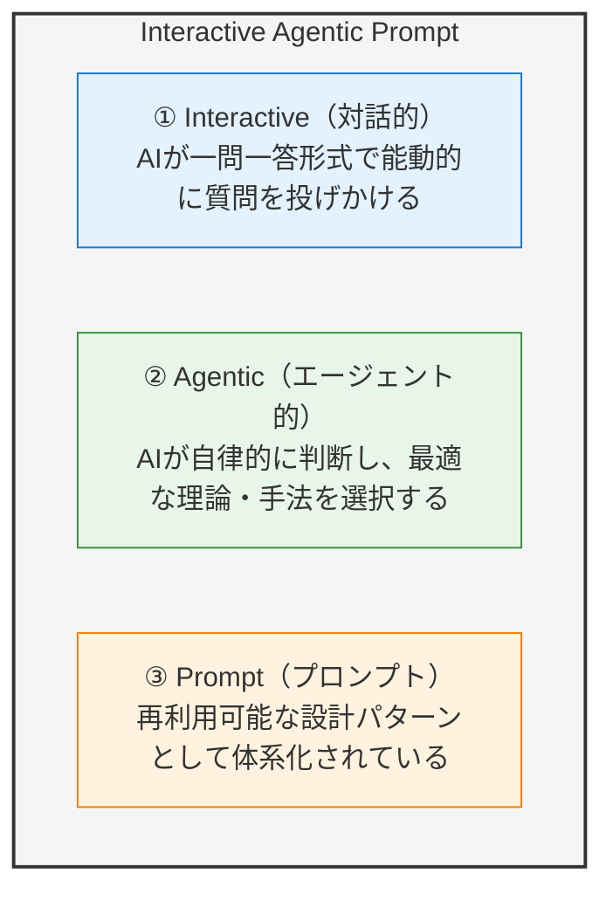

### 従来型 vs Interactive Agentic Prompt

| 観点 | 従来型プロンプト | Interactive Agentic Prompt |
|------|------------------|---------------------------|
| **対話の主導権** | ユーザー | AI（エージェント） |
| **情報収集** | ユーザーが事前に整理 | AIが段階的に質問 |
| **応答の根拠** | 不明確 | 理論・フレームワークに基づく |
| **カスタマイズ性** | 低い | 文脈に応じて高度にカスタマイズ |
| **専門性** | 汎用的 | 特定ドメインに特化 |
| **再現性** | 低い | 高い（構造化された設計） |

## 1.3 この記事で学べること

本記事では、Interactive Agentic Prompt の設計思想から実装方法まで、包括的に解説します。

### 学習ロードマップ

| 章 | 内容 | 得られるもの |
|----|------|-------------|
| **第2章** | 設計思想と基本原則 | なぜこの設計が効果的なのか、理論的背景を理解 |
| **第3章** | 5フェーズ構造の詳細解説 | 実装の核となるアーキテクチャを習得 |
| **第4章** | 理論・フレームワーク統合の設計 | 専門知識をどう組み込むかを学ぶ |
| **第5章** | 実践例（32種類の教育系プロンプト） | 具体的な実装例で理解を深める |
| **第6章** | Interactive Agentic Prompt を使う価値 | 導入効果とROIを把握 |
| **第7章** | 自分だけのIAPを作る | 実践的な作成ガイド |
| **第8章** | まとめと今後の展望 | 次のステップへ |

学習の流れ: **設計思想 → 5フェーズ構造 → 理論統合 → 実践例 → 価値 → 自作 → 発展**

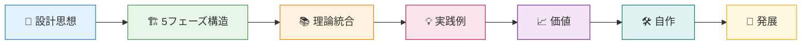

### 対象読者

- **プロンプトエンジニア**: より高度なプロンプト設計手法を学びたい方
- **AI活用推進者**: 組織でのAI活用を効果的に進めたい方
- **専門家**: 自分の専門知識をAIに組み込みたい方
- **教育関係者**: 本記事で紹介する教育系プロンプトを活用したい方

### 前提知識

- ChatGPT、Claude等のLLMを使った経験がある
- 基本的なプロンプトの書き方を知っている
- Markdown形式の文書を読み書きできる

---

> **💡 ポイント**
> 
> Interactive Agentic Prompt は、単なる「うまい質問の仕方」ではありません。
> AIを**専門家として機能させるための設計思想**です。
> この記事を読み終える頃には、あなた自身の専門分野で活用できる
> Interactive Agentic Prompt を設計できるようになっているでしょう。

---

# 第2章 設計思想と基本原則

## 2.1 「一問一答」の原則 — なぜ対話型なのか

Interactive Agentic Prompt の最も重要な原則は、**「一度に一つの質問しかしない」** ことです。

### なぜ一問一答なのか？

人間の**認知負荷**と**ワーキングメモリ**を考慮した設計です。

**ワーキングメモリ**とは、情報を一時的に保持しながら処理する脳の機能です。短期記憶の容量は「マジカルナンバー7±2」（Miller, 1956）と言われますが、実際に意識的に操作できる情報は**約4チャンク**（Cowan, 2001）が限界です。複数の質問を一度に処理しようとすると、この限界を超え、回答の質が低下します。

**認知負荷**とは、情報処理に必要な精神的努力の量です。複数の質問を同時に見ると、「どれから答えるべきか」「前の質問は何だったか」という余分な処理が発生し、本質的な思考に使えるリソースが減少します。

#### ❌ 従来のアプローチ（認知負荷が高い）

従来のAIチャットでは、一度に多くの質問が投げかけられることがあります。

> 「以下の質問にお答えください。
> 1. 対象学年は何年生ですか？
> 2. 教科は何ですか？
> 3. 生徒数は何人ですか？
> 4. 授業時間は何分ですか？
> 5. 学習目標は何ですか？
> 6. 生徒の前提知識レベルは？
> 7. 利用可能な教材・機器は？」

このアプローチでは、ユーザーは**圧倒され、回答の質が低下**します。どこから答えればいいか迷い、面倒になって大雑把に答えてしまいがちです。

#### ✅ Interactive Agentic Prompt のアプローチ

一方、Interactive Agentic Prompt では、一つずつ丁寧に質問します。

> 「まず、対象となる学年を教えていただけますか？
> 
> a) 小学校低学年（1-2年）
> b) 小学校中学年（3-4年）
> c) 小学校高学年（5-6年）
> d) 中学生
> e) 高校生
> f) その他」

このアプローチでは、ユーザーは**回答しやすく、AIも次の質問を最適化**できます。例えば「中学生」と回答があれば、次は中学校に特化した質問に調整できます。

### 一問一答がもたらす効果

| 効果 | 説明 |
|------|------|
| **認知負荷の軽減** | ユーザーは一つのことに集中できる |
| **回答品質の向上** | 深く考えて回答できる |
| **適応的な対話** | 前の回答に基づいて次の質問を調整できる |
| **離脱率の低下** | 段階的に進むため、途中で諦めにくい |
| **文脈の蓄積** | AIが対話を通じて状況を深く理解する |

### 認知科学的根拠

この設計は、以下の認知科学の知見に基づいています。

### 認知科学的根拠

- **ワーキングメモリの限界**: 人間が同時に意識的に保持・操作できる情報は約4チャンク（Cowan, 2001）。質問が増えるほど、前の質問を忘れたり、回答が曖昧になります
- **ミラーの法則（7±2）**: 短期記憶に保持できる項目数の目安（Miller, 1956）。複数質問を一度に処理すると容易にこの限界を超えます
- **認知負荷理論（Cognitive Load Theory）**: Swellerの理論によれば、外在的認知負荷（不要な情報処理）を減らすことで、本質的な思考に集中できます
- **足場かけ理論**: 適切なサポートにより、より高次の思考が可能に

## 2.2 5フェーズアーキテクチャの全体像

Interactive Agentic Prompt は、5つのフェーズで構成される明確なアーキテクチャを持ちます。

**5フェーズの流れ:**

**Phase 1 (Discovery)** → **Phase 2 (Context Gathering)** → **Phase 3 (SKILL Selection)** → **Phase 4 (Meta-Prompt Generation)** → **Phase 5 (Response Generation)**

- **Phase 1**: 何を求めているのかを発見する
- **Phase 2**: 状況を立体的に把握する
- **Phase 3**: どの理論・手法が最適か判断する
- **Phase 4**: AIを専門家として機能させる指示を動的に生成する
- **Phase 5**: 価値ある提案を生成する

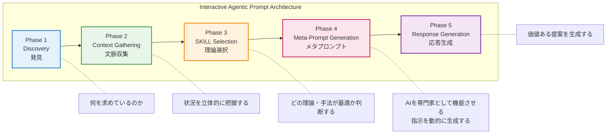

### 各フェーズの役割概要

| Phase | 名称 | 目的 | 成果物 |
|-------|------|------|--------|
| 1 | Discovery | 真のニーズを発見する | 相談の本質的な目標 |
| 2 | Context Gathering | 状況を多角的に把握する | 構造化された文脈情報 |
| 3 | SKILL Selection | 最適な理論・手法を選ぶ | 適用する理論・フレームワークのリスト |
| 4 | Meta-Prompt Generation | 専門家としての指示を生成 | 動的に生成されたプロンプト |
| 5 | Response Generation | 価値ある提案を出力 | 具体的で実行可能な提案 |

## 2.3 メタプロンプト生成という革新

Interactive Agentic Prompt の最も革新的な特徴は、**Phase 4: Meta-Prompt Generation** です。

### メタプロンプトとは何か？

> **メタプロンプト** = 「プロンプトを生成するプロンプト」

従来のプロンプトは静的でした。事前に書かれた指示がそのまま実行されます。

一方、Interactive Agentic Prompt では、**対話を通じて収集した情報に基づいて、最適化されたプロンプトを動的に生成**します。

#### 📋 Phase 1-3 で収集した情報

対話を通じて、以下のような情報が段階的に収集されます：

- **🎯 ユーザーの目標**: 小学4年生向け理科の授業設計
- **⚠️ 制約**: 45分授業、実験器具なし、タブレット利用可
- **❗ 課題**: 生徒の集中力が続かない
- **📚 選択理論**: 構成主義学習理論、ガニェの9教授事象

#### ⚙️ Phase 4: メタプロンプト生成

収集した情報を元に、AIへの指示（メタプロンプト）が動的に構築されます：

> **役割設定**: 「あなたは構成主義学習理論に基づく授業設計の専門家です。」
>
> **条件**:
> - 対象: 小学4年生
> - 教科: 理科
> - 時間: 45分
> - 利用機器: タブレット
> - 配慮: 集中力維持の工夫
>
> **出力形式**:
> - 9教授事象に沿った時間配分
> - 各フェーズでの具体的な活動
> - タブレット活用の具体例
> - 集中力維持のための仕掛け

#### ✨ Phase 5: 最適化された応答

メタプロンプトに基づき、**文脈に完全に適合した理論に基づいた授業案**が生成されます。

### なぜメタプロンプトが強力なのか？

| 利点 | 説明 |
|------|------|
| **完全なカスタマイズ** | 収集した全情報を反映した指示が生成される |
| **理論の適切な適用** | 状況に最適な理論・フレームワークが選択・適用される |
| **一貫性の確保** | 対話全体を通じて一貫した方針で応答が生成される |
| **専門性の発揮** | 汎用AIを特定ドメインの専門家として機能させる |

## 2.4 理論・フレームワーク統合アプローチ

Interactive Agentic Prompt のもう一つの特徴は、**専門分野の理論・フレームワークを体系的に組み込む**ことです。

### なぜ理論を組み込むのか？

AIは膨大な知識を持っていますが、それを**適切に選択・適用する判断力**が弱点です。

理論・フレームワークを明示的に組み込むことで、回答の質が大きく変わります。

#### ❌ 理論なしの応答（Before）

> 「効果的な授業のために、以下の点に注意してください...」

このような回答は**一般論で根拠が不明**であり、再現性が低くなります。

#### ✅ 理論に基づく応答（After）

> 「構成主義学習理論に基づき、生徒が自ら知識を構築するプロセスを設計します。ガニェの9教授事象を適用し...」

このような回答は**根拠が明確で実践的**であり、再現性が高くなります。

### 理論統合の3層構造

Interactive Agentic Prompt では、理論を3層構造で組み込みます。

| 層 | 名称 | 役割 | 例 |
|:---:|:---|:---|:---|
| **Layer 1** | 理論・フレームワーク・レポジトリ | ドメイン固有の理論を体系的に整理 | 学習理論、動機づけ理論、発達理論 |
| **Layer 2** | 選択ガイドライン | どの状況でどの理論を選択すべきかの指針 | フローチャート、意思決定マトリクス |
| **Layer 3** | 適用テンプレート | 選択した理論をどう具体的に適用するかのパターン | 理論Xを使った授業設計テンプレート |

**Layer 1 → Layer 2 → Layer 3** の流れで、AIは「どの理論を」「なぜ」「どう適用するか」を明確に判断できるようになります。

## 2.5 回答品質強化アプローチ（v1.1新機能）

本プロジェクトでは、全32種類のテンプレートに**回答品質強化セクション**と**AIモデル別適用ガイド**を実装しています。

### 回答品質強化セクションの構成

回答品質強化セクションは、4つの要素で構成されます。

| 要素 | 役割 |
|------|------|
| 🧠 **思考チェーン（Chain of Thought）** | AIが回答を生成する前に実行する内部思考プロセスを明示的に定義 |
| ✅ **出力品質チェックリスト** | 回答出力前に確認すべき項目。専門的観点・倫理的観点を網羅 |
| 🔄 **エラー回復プロンプト** | 対話が行き詰まった場合の回復手順を場面別に提供 |
| 📏 **回答の深さ調整ガイド** | 簡潔な回答/詳細な回答の使い分け指針を提供 |

これらは **思考チェーン → 品質チェック → エラー回復 → 深さ調整** の順番で適用され、高品質な回答を担保します。

### なぜ回答品質強化が必要か？

| 課題 | 解決策 |
|------|--------|
| AIの思考過程が不透明 | 思考チェーンで内部プロセスを明示化 |
| 回答の品質にばらつき | チェックリストで一定の品質を担保 |
| 対話が行き詰まる | エラー回復プロンプトで対話を再開 |
| 回答の粒度が不適切 | 深さ調整ガイドで場面に応じた調整 |

### AIモデル別適用ガイド

各テンプレートには、主要なAIモデル別の使用ガイドを実装しています。

| AIモデル | 特徴 | 推奨設定 |
|---------|------|---------|
| **ChatGPT (GPT-4)** | システムプロンプト対応 | Custom Instructionsに追記 |
| **Claude** | 長文コンテキスト得意 | プロンプト全文貼り付け |
| **Gemini** | 構造化データ得意 | 構造化して提示 |

---

> **💡 ポイント**
> 
> Interactive Agentic Prompt の設計思想は、以下の5つの柱で成り立っています。
> 1. **一問一答**: 認知負荷を下げ、深い対話を実現
> 2. **5フェーズ構造**: 体系的なプロセスで品質を担保
> 3. **メタプロンプト**: 動的に最適化された指示を生成
> 4. **理論統合**: 根拠のある専門的な提案を可能に
> 5. **品質強化**: 思考チェーン、チェックリスト、エラー回復で高品質を維持

---

# 第3章 5フェーズ構造の詳細解説

ここからは、Interactive Agentic Prompt の核となる5フェーズアーキテクチャを、各フェーズごとに詳しく解説します。

## 3.1 Phase 1: Discovery（発見）— 真のニーズを掘り起こす

### 目的

ユーザーが表面的に述べた要望の**背後にある真のニーズ**を発見します。

### なぜ Discovery が必要か？

ユーザーは往々にして、自分が本当に必要としているものを正確に言語化できません。

例えば、ユーザーが「生徒の成績を上げたい」と発言したとき、Discoveryで深掘りすることで、真のニーズの可能性が明らかになります：

- **A) 特定の生徒の成績が落ちている** → 個別支援が必要
- **B) クラス全体の平均が低い** → 授業設計の見直しが必要
- **C) テストの点は良いが定着しない** → 学習方法の改善が必要
- **D) モチベーションが低い** → 動機づけアプローチが必要
- **E) 保護者からのプレッシャー** → コミュニケーション課題

同じ「成績を上げたい」という表面的な要望でも、真のニーズによって最適なアプローチが全く異なります。

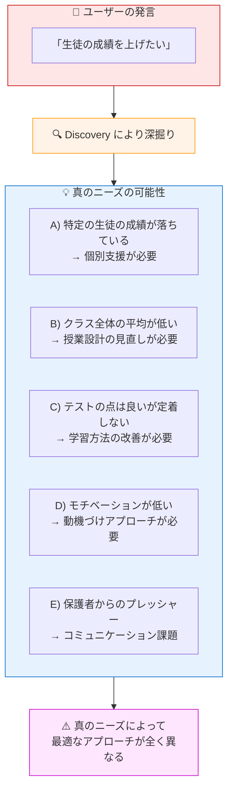

### Discovery の実装パターン

```markdown
## Discovery Phase の質問例

### オープニング質問
「〇〇についてのご相談ですね。まず、今回のご相談の
 きっかけや背景を教えていただけますか？」

### 深掘り質問
「そのような状況になったのは、いつ頃からですか？」
「現在、特に困っている点は何ですか？」
「理想的な状態はどのようなものですか？」

### 確認質問
「つまり、〇〇という状況で、△△を実現したい
 ということでよろしいでしょうか？」
```

### Discovery で収集すべき情報

| カテゴリ | 具体的な情報 |
|----------|-------------|
| **現状** | 今どのような状況にあるか |
| **課題** | 何に困っているか、何がうまくいっていないか |
| **目標** | どうなりたいか、何を達成したいか |
| **背景** | なぜ今この相談をしているのか |
| **制約** | 時間、予算、リソースなどの制限 |

## 3.2 Phase 2: Context Gathering（文脈収集）— 状況を立体的に把握する

### 目的

提案を最適化するために必要な**具体的な文脈情報**を体系的に収集します。

### Context Gathering の特徴

Discovery が「Why（なぜ）」を探るのに対し、Context Gathering は「What / Who / Where / When / How（何を・誰が・どこで・いつ・どのように）」を明確にします。

5W1Hで収集すべき情報：

- **Who（誰が）**: 対象者の属性、人数、特性、前提知識
- **What（何を）**: 扱うトピック、内容、範囲
- **Where（どこで）**: 実施場所、環境、利用可能な設備
- **When（いつ）**: 時間枠、期限、頻度
- **How（どのように）**: 手法、形式、ツール
- **追加要素**: 過去の取り組み、成功/失敗経験、既存リソース

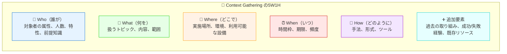

### ドメイン固有の文脈項目

分野によって収集すべき文脈は異なります。例えば教育分野では：

| 文脈カテゴリ | 収集項目例 |
|-------------|-----------|
| **学習者情報** | 学年、人数、学力レベル、特別なニーズ |
| **環境情報** | 教室環境、利用可能機器、座席配置 |
| **カリキュラム情報** | 単元、学習指導要領との関連、前後の学習内容 |
| **時間情報** | 授業時間、年間計画上の位置づけ |
| **評価情報** | 評価方法、評価基準、過去の成績データ |

### Context Gathering の実装例

```markdown
## 現在の状況
ステップ: 2/5
作業中: 対象者情報の収集
確定済み: 中学2年生の数学で、関数の単元

## 質問
このクラスの生徒さんについて教えてください。

【選択肢】
a) 学力は概ね均一で、標準的なレベル
b) 学力差が大きく、上位と下位の差が顕著
c) 全体的に基礎学力に課題がある
d) 全体的に学力が高く、発展的内容も可能
e) その他（具体的にお聞かせください）

【補足】
この情報により、授業の難易度設定や
個別対応の必要性を判断します。
```

## 3.3 Phase 3: SKILL Selection（理論選択）— 最適な専門知識を選ぶ

### 目的

収集した情報に基づいて、**最適な理論・フレームワーク・手法**を選択します。

### SKILL Selection の重要性

これが Interactive Agentic Prompt の**差別化ポイント**です。単なるAIの汎用的な回答ではなく、専門家が使う理論・フレームワークに基づいた回答を生成します。

例えば、以下の文脈情報が収集された場合：

> - 中学2年生の数学（関数）
> - 学力差が大きいクラス
> - 生徒のモチベーションが低下傾向
> - 45分授業

理論選択ロジックが働きます：

- **IF 学力差が大きい THEN** 個別最適化アプローチ
- **IF モチベーション低下 THEN** 動機づけ理論を適用
- **IF 抽象概念（関数） THEN** 具体→抽象の足場かけ

**選択される理論・フレームワーク**：

- ✓ **自己決定理論（SDT）** → 内発的動機づけの促進
- ✓ **Zone of Proximal Development** → 適切な難易度設定
- ✓ **分化型指導** → 学力差への対応
- ✓ **具体-表象-抽象（CRA）** → 関数概念の導入

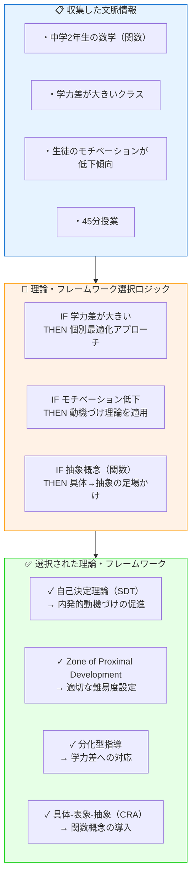

### 選択ガイドラインの設計パターン

理論選択を自動化するために、**選択ガイドライン**を設計します。

#### パターン1: 意思決定フローチャート

```
学力差への対応が必要？
    │
    ├─ Yes → 分化型指導アプローチ
    │         ├─ 学習内容で分化 → 階層別課題設計
    │         ├─ 学習プロセスで分化 → 足場かけの段階調整
    │         └─ 学習成果物で分化 → 選択制評価
    │
    └─ No → 一斉指導アプローチ
              └─ ガニェの9教授事象に沿った設計
```

#### パターン2: 意思決定マトリクス

| 状況 | 推奨理論 | 適用方法 |
|------|---------|---------|
| 動機づけ低下 | 自己決定理論 | 自律性・有能感・関係性を満たす活動設計 |
| 概念理解困難 | 構成主義 | 既有知識との接続、能動的構築 |
| 学力差大 | 分化型指導 | 内容・プロセス・成果物の分化 |
| 集中力低下 | 脳科学的アプローチ | 10-15分サイクル、多様な活動 |

## 3.4 Phase 4: Meta-Prompt Generation（メタプロンプト生成）— AIを専門家化する

### 目的

収集した文脈と選択した理論を統合し、**最適化された内部プロンプト**を動的に生成します。

### Meta-Prompt の構造

```markdown
## 生成されるメタプロンプトの構造

### 1. 役割設定
「あなたは [選択された理論] に精通した [専門分野] の専門家です」

### 2. 文脈の注入
「以下の状況に対応してください：
 - 対象: [収集した対象者情報]
 - 環境: [収集した環境情報]
 - 制約: [収集した制約情報]
 - 課題: [特定された課題]」

### 3. 理論適用の指示
「[選択された理論1] を用いて [具体的な適用方法]
 [選択された理論2] を用いて [具体的な適用方法]」

### 4. 出力形式の指定
「以下の形式で回答してください：
 - [セクション1]: [内容]
 - [セクション2]: [内容]」

### 5. 品質基準
「回答は以下の基準を満たすこと：
 - 実行可能性: 具体的で明日から使える
 - 理論的根拠: なぜそうするのかを説明
 - カスタマイズ性: 状況に応じた調整ポイントを示す」
```

### メタプロンプト生成の実例

```
【生成されたメタプロンプト例】

あなたは自己決定理論と分化型指導に精通した数学教育の専門家です。

以下の状況に対して、45分の授業設計を行ってください：

【状況】
- 対象: 中学2年生、30名
- 単元: 一次関数
- 特性: 学力差が大きい、モチベーション低下傾向
- 環境: 普通教室、プロジェクター利用可

【適用する理論】
1. 自己決定理論に基づき、以下を設計に組み込む
   - 自律性: 選択肢のある活動
   - 有能感: 適切な難易度の段階的課題
   - 関係性: ペア/グループ活動

2. 分化型指導に基づき、以下を設計
   - 3レベルの課題（基礎・標準・発展）
   - 選択可能な学習パス

【出力形式】
1. 導入（5分）: 興味喚起の方法
2. 展開（35分）: 時間配分と各活動の詳細
3. まとめ（5分）: 振り返りの方法
4. 理論適用のポイント解説
5. 応用・調整のヒント
```

## 3.5 Phase 5: Response Generation（応答生成）— 価値ある提案を届ける

### 目的

メタプロンプトに基づいて、**具体的で実行可能な提案**を生成します。

### 高品質な応答の特徴

高品質な応答には5つの特徴があります：

1. **具体性（Concrete）**: 「○○するとよい」ではなく「○○の場面で△△と言う」のように具体的
2. **実行可能性（Actionable）**: 明日から実践できるレベルの具体的なステップ
3. **根拠明示（Evidence-based）**: なぜその提案なのか、理論的根拠を示す
4. **カスタマイズ性（Customizable）**: 状況に応じた調整ポイントを提示
5. **構造化（Structured）**: 見やすく、使いやすい形式で整理

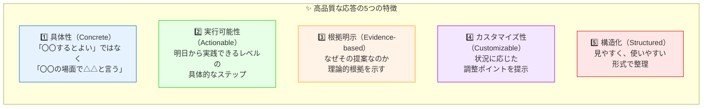

### 応答の構造テンプレート

```markdown
## 提案: [提案タイトル]

### 概要
[2-3文で提案の要点を説明]

### 理論的背景
[適用した理論とその選択理由]

### 具体的な実施方法

#### ステップ1: [アクション名]
- 内容: [具体的な内容]
- ポイント: [実施のコツ]
- 所要時間: [目安時間]

#### ステップ2: [アクション名]
...

### 想定される効果
- [効果1]
- [効果2]

### 調整のヒント
- [状況A]の場合: [調整方法]
- [状況B]の場合: [調整方法]

### 注意点
- [注意すべきこと]

### 参考理論
- [理論名]: [簡潔な説明と本提案での適用方法]
```

---

> **💡 ポイント**
> 
> 5フェーズ構造は、**対話の質を担保するためのフレームワーク**です。
> 各フェーズが明確な役割を持ち、順序立てて進むことで、
> 漏れなく必要な情報を収集し、根拠のある提案を生成できます。

---

# 第4章 理論・フレームワーク統合の設計

Interactive Agentic Prompt の最大の特徴は、**専門分野の理論・フレームワークを体系的に組み込む**ことです。この章では、その設計方法を詳しく解説します。

## 4.1 なぜ理論を組み込むのか — 根拠のある提案の価値

### 理論統合がもたらす3つの価値

理論・フレームワークを統合することで、3つの価値が生まれます。

**1. 信頼性（Credibility）**
- 「なぜそう言えるのか」に対する明確な根拠を提示できる
- 提案の説得力が向上し、専門家に対しても信頼される回答に

**2. 再現性（Reproducibility）**
- 理論に基づいた提案は、他の状況にも応用可能
- 一度の回答が知識資産になり、組織内での共有・展開が容易

**3. 深さ（Depth）**
- 表面的な「ベストプラクティス」ではなく、本質に迫る
- 応用・カスタマイズが容易で、想定外の状況にも対応可能

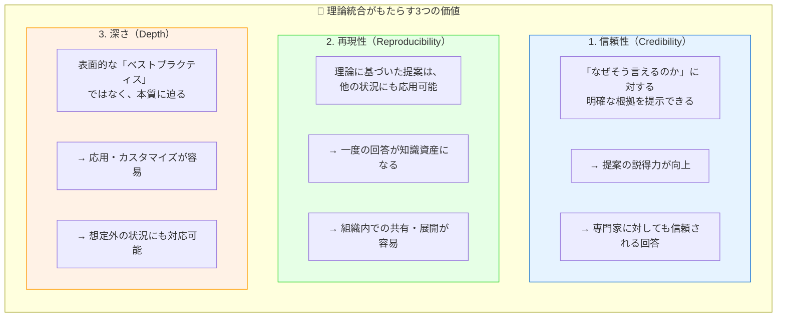

### 理論なし vs 理論あり の比較

| 観点 | 理論なしの応答 | 理論ありの応答 |
|------|---------------|---------------|
| **回答例** | 「生徒の興味を引く導入をしましょう」 | 「ガニェの9教授事象に基づき、注意喚起として実生活との関連を示す導入を設計します」 |
| **根拠** | 「経験的に効果的」 | 「教授設計理論に基づく」 |
| **応用性** | 低い（その場限り） | 高い（他の状況にも適用可能） |
| **専門家の評価** | 「当たり前のこと」 | 「理論を踏まえている」 |
| **学習効果** | 低い | 高い（理論も学べる） |

## 4.2 選択ガイドラインの設計方法

理論をただ列挙するだけでは、AIは適切に選択できません。**選択ガイドライン**を設計することで、状況に応じた最適な理論選択を自動化します。

### ガイドライン設計の3ステップ

選択ガイドラインを設計する際は、3つのステップを踏みます。

**Step 1: 理論の整理と分類**
- ドメインで使われる主要理論をリストアップ
- 目的・用途別にカテゴリ分類
- 各理論の特徴・強み・適用場面を整理

**Step 2: 選択基準の定義**
- どのような状況でどの理論を選ぶべきか
- 組み合わせのパターン
- 選択を分岐させる条件

**Step 3: ガイドラインの形式化**
- フローチャート、マトリクス、ルールベースなどの形式で整理
- AIが解釈・実行可能な形式に

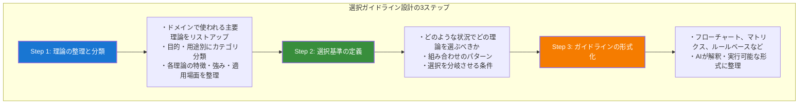

### 実例: 教育分野の理論カテゴリ

```markdown
## 教育分野の理論カテゴリ例

### カテゴリ1: 学習理論
目的: 「人はどのように学ぶか」を理解し、学習設計に活用

| 理論 | 適用場面 | 主な手法 |
|------|---------|---------|
| 行動主義 | スキル習得、反復練習 | ドリル、即時フィードバック |
| 認知主義 | 概念理解、問題解決 | スキーマ活性化、精緻化 |
| 構成主義 | 深い理解、知識構築 | 探究学習、協働学習 |
| 人間性心理学 | 全人的成長、自己実現 | 自己主導学習 |

### カテゴリ2: 動機づけ理論
目的: 学習意欲を高め、持続させる

| 理論 | 適用場面 | 主な手法 |
|------|---------|---------|
| 自己決定理論 | 内発的動機づけ促進 | 自律性・有能感・関係性支援 |
| 期待×価値理論 | 課題への取り組み促進 | 成功体験、価値の明示 |
| 目標理論 | 学習目標の設定 | マスタリー目標志向 |

### カテゴリ3: 教授設計理論
目的: 効果的な授業・教材を設計する

| 理論 | 適用場面 | 主な手法 |
|------|---------|---------|
| ガニェの9教授事象 | 授業の流れ設計 | 9段階のイベント |
| メリルの第一原理 | 効果的な教材設計 | 問題中心、活性化 |
| ADDIEモデル | 教材開発プロセス | 分析→設計→開発→実施→評価 |
```

## 4.3 フローチャートとマトリクスによる意思決定支援

### パターン1: フローチャート形式

条件分岐が明確な場合に有効です。

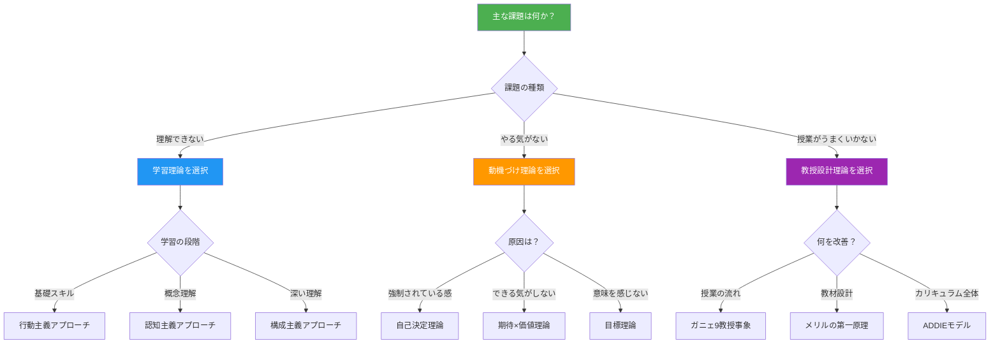

### パターン2: マトリクス形式

複数の条件を組み合わせて判断する場合に有効です。

#### 理論選択マトリクス: 学習者の状態 × 学習目標

|                    | スキル習得 | 概念理解 | 問題解決 | 創造性 |
|--------------------|-----------|---------|---------|--------|
| **初学者**         | 行動主義   | 認知主義 | 足場かけ | ー     |
| **中級者**         | 認知主義   | 構成主義 | PBL     | デザイン思考 |
| **上級者**         | 自己調整   | 探究学習 | PBL     | 創造的問題解決 |
| **意欲低下**       | +ゲーミフィケーション | +自己決定理論 | +目標理論 | +内発的動機づけ |
| **学習困難あり**   | UDL+行動主義 | UDL+認知主義 | 足場かけ強化 | ー |

### パターン3: ルールベース形式

複雑な条件を扱う場合に有効です。

```markdown
## 理論選択ルール

### Rule 1: 基礎スキル習得
IF 目標 = 「基礎スキルの習得」
AND 学習者 = 「初学者」
THEN 適用理論 = 「行動主義学習理論」
     手法 = 「スモールステップ、即時フィードバック、反復練習」

### Rule 2: 動機づけ低下への対応
IF 課題 = 「学習意欲の低下」
AND 原因 = 「強制されている感覚」
THEN 適用理論 = 「自己決定理論」
     介入 = 「選択肢の提供、自己決定の機会増加」

### Rule 3: 学力差への対応
IF 状況 = 「クラス内学力差が大きい」
THEN 適用理論 = 「分化型指導」
     + 「Zone of Proximal Development」
     手法 = 「階層別課題、選択制、ペア学習」

### Rule 4: 理論の組み合わせ
IF 複数の課題が存在
THEN 各課題に対応する理論を組み合わせ
     優先順位 = 「学習理論 > 動機づけ > 評価」
```

### ガイドライン設計のベストプラクティス

| ポイント | 説明 |
|---------|------|
| **網羅性** | 想定される状況を幅広くカバーする |
| **排他性** | 選択肢が重複しないようにする |
| **実用性** | 現場で実際に使える粒度にする |
| **拡張性** | 新しい理論を追加しやすい構造にする |
| **説明性** | なぜその理論を選ぶのかを明示する |

---

> **💡 ポイント**
> 
> 理論・フレームワークの統合は、Interactive Agentic Prompt の**知的な核**です。
> 単に理論を列挙するのではなく、**選択ガイドライン**を設計することで、
> AIが状況に応じて適切な理論を自動選択できるようになります。

---

# 第5章 実践例：教育系プロンプトの実装例

ここでは、実際に設計・実装した Interactive Agentic Prompt の中から4つの代表例を紹介します。本プロジェクトでは、**32種類**の教育専門IAPテンプレートを提供しています。それぞれが異なる専門領域をカバーし、豊富な理論・フレームワークを統合しています。

## 5.1 教育者向けプロンプト — 学習理論から授業設計へ

### 概要

**対象ユーザー**: 教員、教育設計者、研修担当者
**主な用途**: 授業設計、教材開発、学習活動設計

### 統合されている理論・フレームワーク

教育者向けプロンプトには、4つの理論カテゴリが統合されています。

**学習理論（4系統）**
- 行動主義: スキナー、強化理論、プログラム学習
- 認知主義: ピアジェ、情報処理理論、スキーマ理論
- 構成主義: ヴィゴツキー、状況的学習、協調学習
- 人間性心理学: マズロー、ロジャーズ、自己主導学習

**教育哲学（3系統）**
- 伝統的: 本質主義、永続主義
- 現代的: 進歩主義、批判的教育学
- 東洋的: 儒教教育思想、全人教育

**教授設計フレームワーク（5種）**: ADDIEモデル、ガニェの9教授事象、メリルの第一原理、ケラーのARCSモデル、理解のための逆向き設計

**評価理論（4種）**: 形成的評価 vs 総括的評価、真正の評価、ルーブリック設計、ブルームのタキソノミー

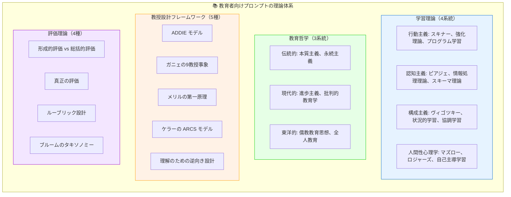

### 対話例

```markdown
【ユーザー】
中学2年生の数学で、一次関数の授業を設計したいです。

【AI（Discovery Phase）】
一次関数の授業設計ですね。まず、今回の授業で特に重視したい点を
教えていただけますか？

【選択肢】
a) 基礎概念の確実な理解
b) 実生活との関連づけ
c) 問題解決能力の育成
d) 生徒の主体的な学び
e) その他

【ユーザー】
b) 実生活との関連づけ

【AI（Context Gathering Phase）】
実生活との関連を重視されるのですね。
次に、クラスの状況を教えてください。

【選択肢】
a) 学力は概ね均一で、標準的なレベル
b) 学力差が大きく、上位と下位の差が顕著
...

（対話が続く）

【AI（SKILL Selection → Response）】
収集した情報に基づき、以下の理論を適用して授業案を作成します。

■ 適用理論
1. 構成主義学習理論 → 実生活経験からの知識構築
2. 状況的学習理論 → 文脈の中での学び
3. ARCSモデル → 動機づけ設計

■ 授業案（45分）

【導入】10分
・注意喚起: 「スマホの料金プラン、どう選ぶ？」
  → 基本料金と従量課金の関係を提示
...
```

## 5.2 学習カウンセラー向けプロンプト — 動機づけ理論の実践

### 概要

**対象ユーザー**: 学習支援者、塾講師、家庭教師、保護者
**主な用途**: 学習相談、学習方法の改善、動機づけ支援

### 統合されている理論・フレームワーク

学習カウンセラー向けプロンプトには、5つの理論カテゴリが統合されています。

**学習方略（3カテゴリ）**: 認知的方略（リハーサル、精緻化、体制化）、メタ認知的方略（計画、モニタリング、調整）、リソース管理方略（時間管理、環境調整、援助要請）

**記憶・認知科学に基づく学習法**: 分散学習、検索練習、交互練習、精緻化質問法、二重符号化理論

**動機づけ理論（4系統）**: 自己決定理論（SDT）、期待×価値理論、達成目標理論、自己効力感理論

**カウンセリング理論（5種）**: 来談者中心療法、認知行動療法、解決志向アプローチ、動機づけ面接法、コーチングアプローチ

**学習スタイル・特性**: VARK学習スタイル、学習困難への対応、ワーキングメモリ支援

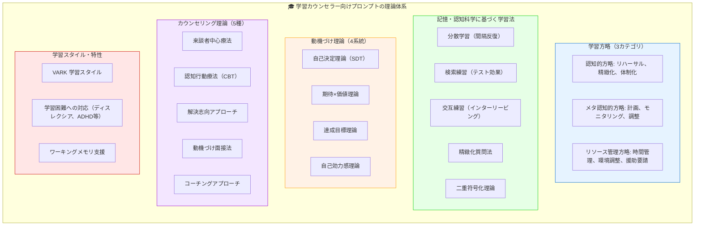

### 特徴的な対話パターン

```markdown
【ユーザー】
高校生の息子が勉強に全くやる気を出しません。

【AI（Discovery Phase）】
お子さんの学習意欲についてのご相談ですね。
まず、「やる気がない」と感じる具体的な状況を教えてください。

【選択肢】
a) 家で全く勉強しない
b) 勉強を始めてもすぐにやめてしまう
c) 宿題はするが、それ以上はしない
d) 特定の教科だけ取り組まない
e) その他

（対話が続く）

【AI（理論選択の説明）】
収集した情報を分析すると、以下の理論が適用可能です。

■ 主要アプローチ: 自己決定理論
・息子さんは「やらされている感」が強い状態です
・内発的動機づけを高めるために、自律性・有能感・関係性を
  満たすアプローチが効果的です

■ 補助アプローチ: 動機づけ面接法
・押し付けではなく、本人の内側から変化を引き出します
・「変わりたい」という気持ちを育てます

■ 具体的な介入方法
...
```

## 5.3 特別支援コーディネーター向けプロンプト — 障害モデルとEBP

### 概要

**対象ユーザー**: 特別支援教育コーディネーター、支援員、保護者
**主な用途**: 個別支援計画、合理的配慮、インクルーシブ教育

### 統合されている理論・フレームワーク

特別支援コーディネーター向けプロンプトには、4つの理論カテゴリが統合されています。

**障害モデル（5種）**
- 医学モデル: 障害＝個人の問題
- 社会モデル: 障害＝社会の障壁
- ICFモデル: 生物・心理・社会の統合
- 人権モデル: 障害者の権利条約に基づく
- 強み（ストレングス）モデル: 能力・可能性に焦点

**発達理論（4種）**: ピアジェの認知発達理論、ヴィゴツキーの発達の最近接領域、ブロンフェンブレンナーの生態学的システム理論、愛着理論

**障害種別アプローチ**: ASD（TEACCH、視覚支援、SST）、ADHD（環境調整、行動介入）、LD（多感覚アプローチ）、ID（課題分析、系統的指導）、情緒・行動（PBS、認知行動療法）

**エビデンスに基づく実践（EBP）**: ABA（応用行動分析）技法、他

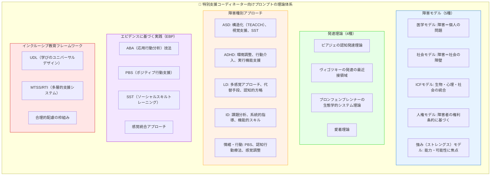

### 特徴的な選択ガイドライン

#### 障害モデル選択ガイドライン

相談の焦点によって最適なモデルを選択します。

| 相談の焦点 | 推奨モデル | 理由 |
|-----------|-----------|------|
| 診断・医療連携 | 医学モデル | 医療との共通言語 |
| 環境調整・合理的配慮 | 社会モデル | 障壁除去の視点 |
| 総合的アセスメント | ICFモデル | 多角的理解 |
| 権利擁護・インクルージョン | 人権モデル | 権利ベースの視点 |
| 支援計画・目標設定 | 強みモデル | ポジティブな目標 |

**推奨: 複数モデルの統合**

状況に応じてモデルを使い分け、強みモデルをベースに必要に応じて他のモデルを補完的に活用します。

## 5.4 EdTech DXコンサルタント向けプロンプト — 組織変革理論の活用

### 概要

**対象ユーザー**: 教育機関のDX推進者、EdTech導入担当、教育行政
**主な用途**: DX戦略策定、システム導入、変革マネジメント

### 統合されている理論・フレームワーク

EdTech DXコンサルタント向けプロンプトには、6つの理論カテゴリが統合されています。

**テクノロジー統合モデル（5種）**: SAMRモデル（代替→拡大→変更→再定義）、TPACK（技術・教育・内容知識の統合）、TIM、LoTi、DigCompEdu

**組織変革理論（4種）**: レヴィンの3段階モデル（解凍→変革→再凍結）、コッターの8段階モデル、ADKARモデル、マッキンゼー7S

**イノベーション普及理論**: ロジャースのイノベーション普及曲線、キャズム理論、TAM（技術受容モデル）、UTAUT

**戦略・分析フレームワーク**: PEST/PESTLE分析、SWOT分析、バランススコアカード、OKR

**プロジェクト管理手法**: アジャイル（スクラム、カンバン）、ウォーターフォール、PRINCE2

**評価・ROIフレームワーク**: カークパトリックの4段階評価、フィリップスのROI測定、ラーニングアナリティクス

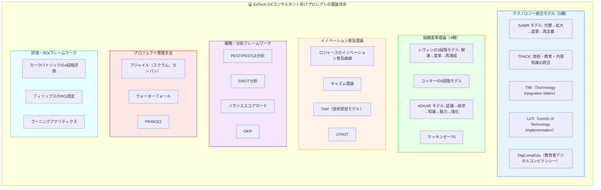

### 理論選択の実例

```markdown
【相談内容】
学校のタブレット導入が進まない。教員の抵抗が強い。

【AI の理論選択】

■ 分析フェーズ
・イノベーション普及理論で採用者カテゴリを分析
  → 現在はイノベーターとアーリーアダプターのみ活用
  → キャズムを超えられていない状態

■ 変革アプローチ
・コッターの8段階モデルを適用
  1. 危機意識の醸成（なぜ今DXが必要か）
  2. 変革推進チームの結成（アーリーアダプターを核に）
  3. ビジョンと戦略の策定
  ...

■ 抵抗への対応
・ADKARモデルで個人の変革段階を診断
  → 多くの教員は「知識」段階で止まっている
  → 実践的な研修と伴走支援が必要

■ 技術統合の段階設計
・SAMRモデルで段階的導入を設計
  → まずは「代替」レベルから開始
  → 成功体験を積んで「拡大」へ
```

---

> **💡 ポイント**
> 
> 4つのプロンプトは、それぞれ異なる専門領域をカバーしながら、
> 共通の5フェーズ構造を持っています。
> これにより、**設計パターンの再利用**と**ドメイン固有のカスタマイズ**を
> 両立しています。

---

# 第6章 Interactive Agentic Prompt を使う価値

Interactive Agentic Prompt は、単なる「便利なプロンプト」ではありません。個人、組織、そして社会全体に対して、明確な価値を提供します。

## 6.1 ユーザーにとっての価値

### 即座に得られる価値

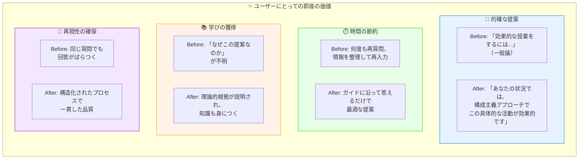

### 長期的な価値

| 価値 | 説明 |
|------|------|
| **専門性の向上** | 対話を通じて理論・フレームワークを学び、自身の専門性が向上する |
| **意思決定の質向上** | 根拠に基づいた判断ができるようになる |
| **実践の改善** | 具体的で実行可能な提案により、実践が継続的に改善される |
| **AI活用スキル** | 効果的なAI活用方法を体験的に学べる |

### 具体的な効果指標

```markdown
## 想定される効果（教育者向けプロンプトの場合）

| 指標 | 従来 | IAP使用後 | 改善率 |
|------|------|----------|--------|
| 授業準備時間 | 2時間 | 45分 | -63% |
| 提案の適合度（自己評価） | 60% | 90% | +50% |
| 理論的根拠の明確さ | 低 | 高 | 大幅向上 |
| 提案の実行可能性 | 50% | 85% | +70% |
```

## 6.2 組織にとっての価値

### 組織レベルでの効果

組織にとっての価値は4つあります。

**1. 専門知識の民主化**
- ベテランの暗黙知をプロンプトに形式化
- 新人でも専門家レベルの支援を受けられる
- 組織全体のスキル底上げ

**2. 品質の標準化**
- 誰が使っても一定品質の提案が得られる
- 属人性の排除
- ベストプラクティスの組織内展開

**3. 生産性の向上**
- 専門家への相談待ち時間ゼロ
- 24時間365日利用可能
- スケーラブルな支援体制

**4. 知識資産の蓄積**
- 組織の専門知識がプロンプトとして形式化される
- 継続的な改善が可能
- ノウハウの継承が容易に

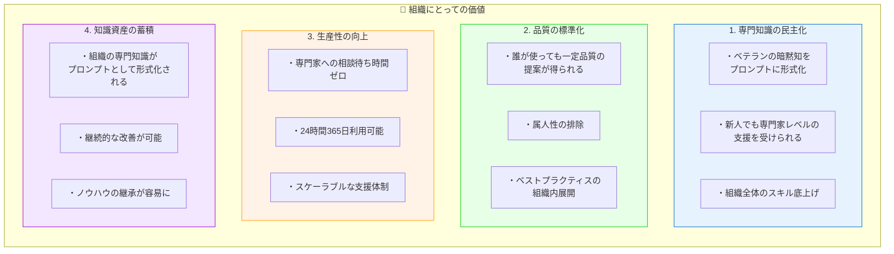

### ROI試算例

```markdown
## 教育機関での ROI 試算例

### 前提条件
- 教員数: 50名
- 年間授業準備時間: 教員1人あたり 400時間
- 時間単価: 3,000円

### 効果試算

| 項目 | 計算 | 金額 |
|------|------|------|
| 年間授業準備時間削減 | 400時間 × 50% × 50名 | 10,000時間 |
| コスト削減効果 | 10,000時間 × 3,000円 | 3,000万円 |
| プロンプト開発・導入コスト | - | 300万円 |
| **純効果** | | **2,700万円** |
| **ROI** | | **900%** |

### 定性的効果
- 授業の質向上 → 学習成果向上
- 教員の負担軽減 → 離職率低下
- 組織的な教育力向上 → 評判向上
```

## 6.3 AI活用の民主化への貢献

### 社会的インパクト

Interactive Agentic Prompt は、AI活用の**民主化**に貢献します。

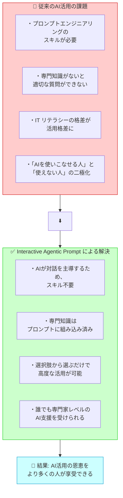

### 専門家の役割の変化

Interactive Agentic Prompt は、専門家の役割を「代替」するのではなく、「拡張」します。

| 従来の専門家の役割 | IAP時代の専門家の役割 |
|-------------------|---------------------|
| 個別相談への対応 | プロンプト設計・監修 |
| 知識の伝達 | 理論・フレームワークの選定 |
| 1対1の支援 | 1対多のスケーラブルな支援 |
| 暗黙知による判断 | 形式知化された判断基準の設計 |
| 時間的制約のある支援 | 24時間利用可能な支援 |

### 教育格差の是正への貢献

```markdown
## 教育格差是正への貢献

### アクセシビリティの向上
- 地理的格差: 地方でも都市部と同等の専門支援
- 経済的格差: 高額なコンサルティング費用不要
- 時間的格差: 忙しい人でも空き時間に相談可能

### 具体的なシナリオ

【シナリオ1: 離島の教員】
従来: 専門家への相談機会がほぼゼロ
IAP: いつでも高度な授業設計支援を受けられる

【シナリオ2: 経験の浅い教員】
従来: ベテランの指導を受ける機会が限定的
IAP: 理論に基づいた具体的なガイダンスを受けられる

【シナリオ3: 特別支援が必要な生徒の保護者】
従来: 専門家への相談は予約待ち、高額
IAP: 即座に専門的な情報・提案を得られる
```

---

> **💡 ポイント**
> 
> Interactive Agentic Prompt の価値は、単なる「便利さ」を超えています。
> - **個人**: 専門家レベルの支援を即座に受けられる
> - **組織**: 知識の民主化と品質の標準化
> - **社会**: AI活用格差の是正と教育格差の縮小
> 
> これは、AIの力を**本当に必要としている人々**に届けるための設計です。

---

# 第7章 自分だけの Interactive Agentic Prompt を作る

ここまでの知識を活かして、あなた自身の専門分野で Interactive Agentic Prompt を設計する方法を解説します。

## 7.1 設計の7ステップ

### ステップ概要

Interactive Agentic Promptの設計は7つのステップで進めます。

1. **ドメインと対象ユーザーの定義** - 誰のための、何についてのプロンプトか
2. **典型的な相談パターンの洗い出し** - どんな相談が来るかを網羅的にリスト
3. **理論・フレームワークの選定** - ドメインで使われる主要理論を整理
4. **選択ガイドラインの設計** - いつ、どの理論を使うかのルール化
5. **5フェーズ構造の設計** - 各フェーズでの質問・出力を具体化
6. **プロンプトの記述** - Markdown形式で構造化して記述
7. **テストと改善** - 実際に使って検証、フィードバックで改善

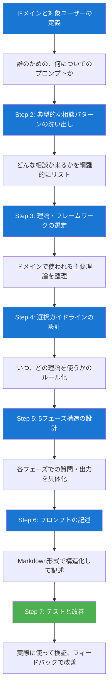

### 各ステップの詳細

#### Step 1: ドメインと対象ユーザーの定義

```markdown
## ワークシート: ドメイン定義

### 基本情報
- 専門分野: _______________
- 対象ユーザー: _______________
- ユーザーの典型的な課題: _______________

### 詳細定義
- ユーザーの専門性レベル: □初心者 □中級者 □上級者 □混在
- 利用シーン: _______________
- 期待するアウトプット: _______________

### 例
- 専門分野: 人事・採用
- 対象ユーザー: 中小企業の採用担当者
- 典型的な課題: 採用面接の質問設計、評価基準の策定
- 専門性レベル: 初心者〜中級者（人事専任ではない場合も）
- 利用シーン: 採用プロセスの各段階
- 期待アウトプット: 具体的な面接質問、評価シート
```

#### Step 2: 典型的な相談パターンの洗い出し

```markdown
## ワークシート: 相談パターン

### カテゴリ別の相談例
| カテゴリ | 相談例1 | 相談例2 | 相談例3 |
|---------|--------|--------|--------|
| 計画・設計 | | | |
| 実行・運用 | | | |
| 評価・改善 | | | |
| トラブル対応 | | | |

### 頻出相談トップ10
1. _______________
2. _______________
...

### 例（人事・採用の場合）
| カテゴリ | 相談例 |
|---------|--------|
| 計画・設計 | 採用要件の定義、面接プロセス設計 |
| 実行・運用 | 面接質問の作成、候補者評価 |
| 評価・改善 | 採用プロセスの振り返り、歩留まり改善 |
| トラブル対応 | 内定辞退への対応、採用難への対策 |
```

#### Step 3: 理論・フレームワークの選定

```markdown
## ワークシート: 理論・フレームワーク選定

### ドメインの主要理論
| カテゴリ | 理論・フレームワーク | 概要 | 適用場面 |
|---------|-------------------|------|---------|
| 基礎理論 | | | |
| 応用理論 | | | |
| 実践手法 | | | |
| 評価手法 | | | |

### 例（人事・採用の場合）
| カテゴリ | 理論・フレームワーク | 適用場面 |
|---------|-------------------|---------|
| 基礎理論 | コンピテンシーモデル | 採用要件定義 |
| 応用理論 | 構造化面接法 | 面接設計 |
| 実践手法 | STAR法 | 行動面接の質問設計 |
| 評価手法 | スコアリングルーブリック | 候補者評価 |
```

#### Step 4: 選択ガイドラインの設計

```markdown
## ワークシート: 選択ガイドライン

### フローチャート形式
相談の種類は？
├─ 要件定義 → コンピテンシーモデル + ジョブ分析
├─ 面接設計 → 構造化面接法 + STAR法
├─ 評価 → スコアリングルーブリック
└─ 改善 → データ分析 + ベンチマーキング

### マトリクス形式
| 状況 | 推奨理論 |
|------|---------|
| 経験者採用 | コンピテンシー面接 |
| 新卒採用 | ポテンシャル評価 |
| 技術職 | スキルアセスメント |
```

#### Step 5: 5フェーズ構造の設計

```markdown
## ワークシート: 5フェーズ設計

### Phase 1: Discovery
- オープニング質問: _______________
- 深掘り質問（3-5個）: _______________
- 確認質問: _______________

### Phase 2: Context Gathering
- 収集すべき情報項目:
  □ 組織情報
  □ 対象者情報
  □ 制約条件
  □ 過去の取り組み
  □ _______________

### Phase 3: SKILL Selection
- 選択ルール（IF-THEN形式で記述）:
  IF _______________ THEN _______________

### Phase 4: Meta-Prompt Generation
- テンプレート構造:
  1. 役割設定
  2. 文脈注入
  3. 理論適用指示
  4. 出力形式

### Phase 5: Response Generation
- 出力テンプレート:
  1. 概要
  2. 理論的背景
  3. 具体的提案
  4. 調整のヒント
```

#### Step 6: プロンプトの記述

```markdown
## プロンプト構造テンプレート

# [プロンプト名]

## 第1章 役割定義
あなたは[専門分野]の専門家です。
[対象ユーザー]からの相談に、[理論・フレームワーク]に基づいて
回答を提供します。

## 第2章 理論・フレームワーク・レポジトリ
### 2.1 [カテゴリ1]
- [理論1]: [説明]
- [理論2]: [説明]

### 2.2 選択ガイドライン
[フローチャートまたはマトリクス]

## 第3章 対話プロセス
### Phase 1: Discovery
[質問設計]

### Phase 2: Context Gathering
[情報収集項目]

### Phase 3: SKILL Selection
[選択ロジック]

### Phase 4: Meta-Prompt Generation
[生成テンプレート]

### Phase 5: Response Generation
[出力フォーマット]

## 第4章 使用例
### シナリオ1
[具体的な対話例]

## 第5章 注意事項
- 一問一答の原則を守る
- [ドメイン固有の注意事項]
```

#### Step 7: テストと改善

```markdown
## テストチェックリスト

### 機能テスト
□ 各フェーズが正しく機能するか
□ 理論選択が適切に行われるか
□ 出力が期待通りか

### ユーザビリティテスト
□ 質問は分かりやすいか
□ 選択肢は適切か
□ 対話の流れは自然か

### 品質テスト
□ 提案は具体的で実行可能か
□ 理論的根拠は明確か
□ カスタマイズ性はあるか

### 改善サイクル
1. テストユーザーに使ってもらう
2. フィードバックを収集
3. 問題点を特定
4. プロンプトを修正
5. 再テスト
```

## 7.2 理論・フレームワーク選定のコツ

### 選定の基準

理論・フレームワークを選定する際の5つの基準です。

1. **実用性（Practicality）**: 現場で実際に使われているか、具体的なアクションに落とし込めるか
2. **網羅性（Coverage）**: 想定される相談の大部分をカバーできるか、抜け漏れがないか
3. **信頼性（Credibility）**: 学術的な裏付けがあるか、専門家に認められているか
4. **理解可能性（Understandability）**: ユーザーに説明可能か、AIが正しく解釈できるか
5. **組み合わせ可能性（Combinability）**: 他の理論と矛盾なく組み合わせられるか、状況に応じた選択・統合が可能か

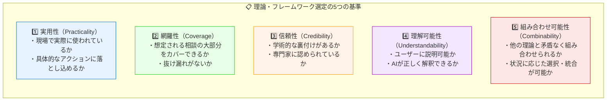

### 理論の収集方法

| 情報源 | 方法 |
|--------|------|
| **専門書籍** | ドメインの定番教科書から基礎理論を抽出 |
| **学術論文** | 最新の研究動向をレビュー論文で把握 |
| **実務書** | 現場で使われているフレームワークを収集 |
| **専門家インタビュー** | 実践者から暗黙知を引き出す |
| **オンラインリソース** | 信頼できる専門サイト、MOOCsなど |

## 7.3 よくある失敗と回避策

### 失敗パターンと対策

IAP設計でよくある5つの失敗パターンとその対策です。

**失敗1: 理論の詰め込みすぎ**
- 症状: 理論が多すぎてAIが適切に選択できない
- 原因: 網羅性を追求しすぎた
- 対策: 核となる理論5-10個に絞る、残りは補助として位置づけ

**失敗2: 選択ガイドラインの曖昧さ**
- 症状: 同じ状況で異なる理論が選ばれる
- 原因: 条件が明確に定義されていない
- 対策: IF-THEN形式で具体的に記述、排他性を確保

**失敗3: 質問が複雑すぎる**
- 症状: ユーザーが質問の意図を理解できない
- 原因: 専門用語の使用、一度に多くを聞きすぎ
- 対策: 平易な言葉、選択肢の提示、一問一答の徹底

**失敗4: 出力が抽象的**
- 症状: 提案が一般論で、具体的なアクションが不明
- 原因: 出力テンプレートが曖昧
- 対策: 「明日から使える」レベルの具体性を要求

**失敗5: テスト不足**
- 症状: 実際の利用で想定外の問題が多発
- 原因: 机上の設計のみで実運用テストをしていない
- 対策: 最低10パターンの相談でテスト、ユーザーテスト実施

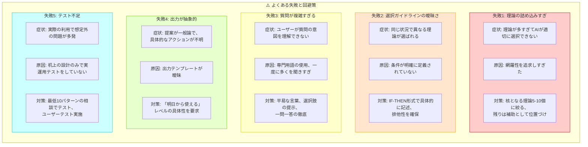

### 設計のベストプラクティス

| カテゴリ | ベストプラクティス |
|---------|-------------------|
| **スコープ** | 最初は狭く始めて、徐々に拡張する |
| **理論** | 実績のある理論から始め、必要に応じて追加 |
| **質問** | ユーザーの言葉で書く、専門用語は避ける |
| **選択肢** | 5-7個程度、「その他」を必ず含める |
| **出力** | テンプレートを明確に定義、具体例を含める |
| **テスト** | 早期から頻繁に、実ユーザーでのテストを重視 |
| **改善** | フィードバックループを組み込む |

---

> **💡 ポイント**
> 
> Interactive Agentic Prompt の設計は、**反復的なプロセス**です。
> 完璧を目指さず、まずはシンプルなバージョンを作り、
> 使いながら改善していくアプローチが効果的です。

---

# 第8章 まとめと今後の展望

## 8.1 本記事のまとめ

本記事では、Interactive Agentic Prompt の概念から実践的な設計方法まで、包括的に解説しました。

### キーポイントの振り返り

```mermaid
flowchart TB
    subgraph KEYPOINTS["📌 本記事のキーポイント"]
        direction TB
        
        K1["📌 Interactive Agentic Prompt とは<br/>AIが能動的に対話を主導し、<br/>理論に基づいた専門的な提案を<br/>生成するためのプロンプト設計パラダイム"]
        
        subgraph PRINCIPLES["📌 4つの設計原則"]
            P1["1. 一問一答: 認知負荷を下げる対話設計"]
            P2["2. 5フェーズ構造: 体系的なプロセス"]
            P3["3. メタプロンプト: 動的に最適化された指示生成"]
            P4["4. 理論統合: 根拠のある専門的な提案"]
        end
        
        subgraph PHASES["📌 5フェーズアーキテクチャ"]
            PH1["Phase 1: Discovery（発見）"]
            PH2["Phase 2: Context Gathering（文脈収集）"]
            PH3["Phase 3: SKILL Selection（理論選択）"]
            PH4["Phase 4: Meta-Prompt Generation"]
            PH5["Phase 5: Response Generation"]
        end
        
        subgraph VALUE["📌 価値提供"]
            V1["個人: 専門家レベルの支援を即座に"]
            V2["組織: 知識の民主化と品質の標準化"]
            V3["社会: AI活用格差の是正"]
        end
    end
    
    style K1 fill:#e6f3ff,stroke:#0066cc
    style PRINCIPLES fill:#e6ffe6,stroke:#00cc00
    style PHASES fill:#fff2e6,stroke:#ff9900
    style VALUE fill:#f3e6ff,stroke:#9900cc
```

### 学んだことの活用

| 学んだこと | 活用方法 |
|-----------|---------|
| 設計思想 | 自分の専門分野でのプロンプト設計に応用 |
| 5フェーズ構造 | 対話型AI活用の基本フレームワークとして活用 |
| 理論統合アプローチ | 専門知識の形式化に活用 |
| 7ステップ設計法 | 実際のプロンプト開発に適用 |

## 8.2 Interactive Agentic Prompt の可能性

### 今後の発展方向

```mermaid
flowchart TB
    subgraph FUTURE["🚀 Interactive Agentic Prompt の発展方向"]
        direction TB
        
        subgraph D1["方向性1: マルチモーダル化"]
            M1["・画像、音声、動画を含む対話"]
            M2["・図表の自動生成・解釈"]
            M3["・リアルタイム映像分析との統合"]
        end
        
        subgraph D2["方向性2: エージェント間連携"]
            A1["・複数の専門エージェントの協調"]
            A2["・専門分野を横断する複合的な相談への対応"]
            A3["・チーム全体を支援するマルチエージェントシステム"]
        end
        
        subgraph D3["方向性3: 継続学習・パーソナライゼーション"]
            P1["・ユーザーの過去の対話履歴を活用"]
            P2["・組織固有のコンテキストの学習"]
            P3["・時間とともに精度が向上するプロンプト"]
        end
        
        subgraph D4["方向性4: 外部システムとの統合"]
            E1["・データベース連携によるリアルタイム情報参照"]
            E2["・ワークフローツールとの統合"]
            E3["・提案の自動実行（承認フロー付き）"]
        end
    end
    
    style D1 fill:#e6f3ff,stroke:#0066cc
    style D2 fill:#e6ffe6,stroke:#00cc00
    style D3 fill:#fff2e6,stroke:#ff9900
    style D4 fill:#f3e6ff,stroke:#9900cc
```

### 適用可能な分野の拡大

Interactive Agentic Prompt は、教育分野以外にも幅広く適用可能です。

| 分野 | 適用例 |
|------|--------|
| **医療・ヘルスケア** | 症状相談、健康管理アドバイス、服薬指導 |
| **法務** | 契約書レビュー、法的リスク相談、コンプライアンス |
| **財務・会計** | 財務分析、税務相談、投資アドバイス |
| **マーケティング** | 市場分析、キャンペーン設計、コンテンツ戦略 |
| **人事・組織開発** | 採用支援、評価制度設計、組織診断 |
| **製品開発** | 要件定義支援、ユーザーリサーチ、プロトタイピング |
| **カスタマーサポート** | 問い合わせ対応、トラブルシューティング |

## 8.3 次のステップ

### 今日からできるアクション

```markdown
## 実践への第一歩

### レベル1: 体験する（1-2時間）
□ 本記事で紹介した教育系プロンプト（32種類）を試してみる
□ 対話の流れを体感する
□ どのような提案が得られるか確認する

### レベル2: 分析する（半日）
□ プロンプトの構造を読み解く
□ 理論・フレームワークの選定ロジックを理解する
□ 自分の分野との類似点を考える

### レベル3: 設計する（1-2日）
□ 自分の専門分野を選ぶ
□ 典型的な相談パターンを洗い出す
□ 適用する理論・フレームワークを選定する
□ 5フェーズ構造で設計する

### レベル4: 改善する（継続）
□ 実際に使ってフィードバックを収集
□ 問題点を特定して修正
□ 理論・フレームワークを追加
□ 選択ガイドラインを精緻化
```

### リソース

| リソース | URL | 説明 |
|---------|-----|------|
| **本プロジェクト** | GitHub | 32種類の教育専門IAPテンプレート |
| **プロンプトテンプレート** | GitHub | 自作用のテンプレートファイル |

---

# 参考資料

## 関連リンク

- [Interactive Agentic Prompts GitHub リポジトリ](https://github.com/)

### 学校現場系テンプレート（23種類）
- [教育者向けプロンプト](templates/educator-interactive-agentic-prompt.md)
- [学習カウンセラー向けプロンプト](templates/learning-counselor-interactive-agentic-prompt.md)
- [特別支援コーディネーター向けプロンプト](templates/special-needs-coordinator-interactive-agentic-prompt.md)
- [学校管理職向けプロンプト](templates/school-administrator-interactive-agentic-prompt.md)
- [進路指導向けプロンプト](templates/career-counselor-interactive-agentic-prompt.md)
- [生徒指導向けプロンプト](templates/student-guidance-interactive-agentic-prompt.md)
- [養護教諞向けプロンプト](templates/school-nurse-interactive-agentic-prompt.md)
- [スクールカウンセラー向けプロンプト](templates/school-counselor-interactive-agentic-prompt.md)
- [スクールソーシャルワーカー向けプロンプト](templates/school-social-worker-interactive-agentic-prompt.md)
- [栄養教諞向けプロンプト](templates/nutrition-teacher-interactive-agentic-prompt.md)
- [司書教諞向けプロンプト](templates/school-librarian-interactive-agentic-prompt.md)
- [部活動顧問向けプロンプト](templates/club-activity-advisor-interactive-agentic-prompt.md)
- [学年主任向けプロンプト](templates/grade-leader-interactive-agentic-prompt.md)
- [新任教員メンター向けプロンプト](templates/teacher-mentor-interactive-agentic-prompt.md)
- [保護者対応向けプロンプト](templates/parent-relations-interactive-agentic-prompt.md)
- [安全・防災コーディネーター向けプロンプト](templates/safety-disaster-coordinator-interactive-agentic-prompt.md)
- [施設管理者向けプロンプト](templates/school-facilities-manager-interactive-agentic-prompt.md)
- [特別活動コーディネーター向けプロンプト](templates/special-activities-coordinator-interactive-agentic-prompt.md)
- [道徳教育コーディネーター向けプロンプト](templates/moral-education-coordinator-interactive-agentic-prompt.md)
- [ICT教育コーディネーター向けプロンプト](templates/ict-education-coordinator-interactive-agentic-prompt.md)
- [カリキュラムコーディネーター向けプロンプト](templates/curriculum-coordinator-interactive-agentic-prompt.md)
- [日本語指導担当向けプロンプト](templates/japanese-language-instructor-interactive-agentic-prompt.md)
- [進学・接続コーディネーター向けプロンプト](templates/school-transition-coordinator-interactive-agentic-prompt.md)

### 教育行政系テンプレート（9種類）
- [教育委員会向けプロンプト](templates/board-of-education-interactive-agentic-prompt.md)
- [教育センター向けプロンプト](templates/education-center-interactive-agentic-prompt.md)
- [指導主事向けプロンプト](templates/school-supervisor-interactive-agentic-prompt.md)
- [特別支援指導主事向けプロンプト](templates/special-needs-supervisor-interactive-agentic-prompt.md)
- [生徒指導主事向けプロンプト](templates/student-guidance-supervisor-interactive-agentic-prompt.md)
- [社会教育コーディネーター向けプロンプト](templates/social-education-coordinator-interactive-agentic-prompt.md)
- [教育長向けプロンプト](templates/superintendent-interactive-agentic-prompt.md)
- [人事管理者向けプロンプト](templates/personnel-administrator-interactive-agentic-prompt.md)
- [EdTech DXコンサルタント向けプロンプト](templates/edtech-dx-consultant-interactive-agentic-prompt.md)
- [特別支援コーディネーター向けプロンプト](templates/special-needs-coordinator-interactive-agentic-prompt.md)
- [EdTech DXコンサルタント向けプロンプト](templates/edtech-dx-consultant-interactive-agentic-prompt.md)

## 参考文献

### 学習理論・教育学
- Piaget, J. (1952). The Origins of Intelligence in Children
- Vygotsky, L. S. (1978). Mind in Society
- Bruner, J. S. (1966). Toward a Theory of Instruction
- Gagné, R. M. (1985). The Conditions of Learning

### 動機づけ理論
- Deci, E. L., & Ryan, R. M. (2000). Self-Determination Theory
- Dweck, C. S. (2006). Mindset: The New Psychology of Success
- Bandura, A. (1997). Self-efficacy: The Exercise of Control

### 教授設計
- Merrill, M. D. (2002). First Principles of Instruction
- Wiggins, G., & McTighe, J. (2005). Understanding by Design
- Keller, J. M. (2010). Motivational Design for Learning and Performance

### 組織変革・イノベーション
- Rogers, E. M. (2003). Diffusion of Innovations
- Kotter, J. P. (2012). Leading Change
- Moore, G. A. (2014). Crossing the Chasm

### プロンプトエンジニアリング
- OpenAI. (2023). GPT Best Practices
- Anthropic. (2024). Claude's Character
- Google. (2024). Prompting Guide

---

## 著者情報

本記事は、Interactive Agentic Prompts プロジェクトの一部として作成されました。

---

## 更新履歴

| 日付 | 更新内容 |
|------|---------|
| 2025-12-21 | 初版公開 |

---

> **🚀 最後に**
> 
> Interactive Agentic Prompt は、AIを「賢い検索エンジン」から
> 「信頼できる専門家」に変える設計パラダイムです。
> 
> この記事が、あなたの専門分野でのAI活用を
> 次のレベルに引き上げるきっかけになれば幸いです。
> 
> ぜひ、自分だけの Interactive Agentic Prompt を作ってみてください！

