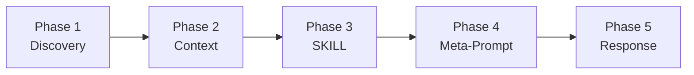

# Technology Stack

**Project**: InteractiveAgenticPrompts (KOTODAMA)
**Last Updated**: 2025-12-21
**Version**: 1.4

---

## Overview

本プロジェクトは、教育現場向けInteractive Agentic Promptテンプレートのリポジトリです。
**32種類**の専門役割向けテンプレートを提供し、学校現場から教育行政まで幅広くカバーしています。
主にMarkdownドキュメントで構成され、コード実装は含まれません。

---

## Primary Technologies

### ドキュメント形式

| 技術 | 用途 | 備考 |
|------|------|------|
| Markdown | テンプレート・ドキュメント | 主要なフォーマット |
| Mermaid | 図表・ダイアグラム | フローチャート、シーケンス図 |
| YAML | コンテキスト定義 | 収集項目の構造化 |

### 開発環境

| ツール | 用途 | 備考 |
|--------|------|------|
| VS Code | エディタ | Markdownプレビュー対応 |
| GitHub Copilot | AIアシスタント | MUSUBI SDD対応 |
| Git | バージョン管理 | GitHubリポジトリ |

---

## IAP Template Components

### 5フェーズ構造



### 各フェーズの構成要素

| フェーズ | 構成要素 | 形式 |
|---------|----------|------|
| Discovery | 深掘り質問フレームワーク | Markdownリスト |
| Context Gathering | 必須収集項目 | YAML形式 |
| SKILL Selection | 理論・フレームワーク表 | Markdownテーブル |
| Meta-Prompt Generation | テンプレート | コードブロック |
| Response Generation | 出力フォーマット | Markdownテンプレート |

---

## 理論・フレームワークリポジトリ

### 教育理論

| カテゴリ | 主な理論 |
|------------|----------|
| 授業設計 | UbD, ブルームのタキソノミー, ARCS |
| 学習理論 | 構成主義, 社会構成主義, UDL |
| 評価 | 形成的評価, ルーブリック |

### 心理・カウンセリング

| カテゴリ | 主な理論 |
|------------|----------|
| カウンセリング | 来談者中心, CBT, 解決志向 |
| 発達心理 | Erikson, Piaget, 愛着理論 |
| モチベーション | 自己決定理論, 達成目標理論 |

### 組織・マネジメント

| カテゴリ | 主な理論 |
|------------|----------|
| リーダーシップ | サーバント, 変革型, 状況対応型 |
| 組織開発 | 学習する組織, Kotterの8ステップ |
| チーム | タックマンモデル, 心理的安全性 |

### 生徒指導

| カテゴリ | 主な理論 |
|------------|----------|
| 行動支援 | PBS, ABA, FBA |
| いじめ対応 | 4層構造, 修復的実践 |
| 不登校 | 7段階モデル, 段階的復帰 |

### キャリア教育

| カテゴリ | 主な理論 |
|------------|----------|
| キャリア発達 | Holland, Super, Savickas |
| 意思決定 | 計画的偶発性, SCCT |

---

## Documentation Standards

### Markdown規約

- 見出しは`#`から`######`までを階層的に使用
- テーブルはMarkdown形式を使用
- コードブロックは言語指定を付与
- 図表はMermaidを推奨

### ファイル命名規約

```
[role]-interactive-agentic-prompt.md
```

例: `educator-interactive-agentic-prompt.md`

---

## Template Categories Summary

本プロジェクトは以下のカテゴリに分類される32種類のテンプレートを提供しています：

| カテゴリ | テンプレート数 | 概要 |
|----------|---------------|------|
| 教育・学習支援系 | 8 | 教員、学習支援、特別支援、司書等 |
| 生徒指導・相談系 | 7 | 生徒指導、進路、養護教諭、SC、SSW等 |
| マネジメント・連携系 | 5 | 管理職、学年主任、メンター、保護者対応等 |
| 安全・環境系 | 3 | 防災、施設管理、特別活動 |
| 部活・課外活動系 | 1 | 部活動顧問 |
| 教育行政系 | 9 | 教育委員会、教育センター、指導主事、教育長等 |

---

## Version Control

### GitHubリポジトリ管理

- **バージョン管理**: Git
- **ホスティング**: GitHub
- **ブランチ戦略**: main / develop / feature/*

---

## Quality Assurance

### テンプレート品質基準

1. **5フェーズ構造の遵守**: 全テンプレートが統一構造に従う
2. **専門理論の根拠**: 各分野の主要理論・フレームワークを網羅
3. **実用性**: 実際の教育現場で活用可能な内容
4. **一貫性**: 用語・フォーマットの統一
5. **回答品質強化**: 思考チェーン、品質チェックリスト、エラー回復プロンプトを全テンプレートに実装
6. **AIモデル対応**: ChatGPT/Claude/Gemini向けの適用ガイドを全テンプレートに実装

---

## Template Lifecycle

### テンプレート作成プロセス

1. **対象役割の特定**: 教育現場の専門役割を明確化
2. **理論・フレームワーク調査**: 該当分野の主要理論を収集
3. **5フェーズ設計**: 統一構造に基づいたテンプレート設計
4. **レビュー・検証**: 実用性と専門性の確認
5. **統合**: テンプレート集への追加

### テンプレート更新ポリシー

- **定期見直し**: 教育政策・理論の更新に応じて見直し
- **フィードバック反映**: ユーザーからの改善提案を検討
- **バージョン管理**: 重要な変更はバージョン番号を更新

---

## Changelog

### Version 1.4 (2025-12-21)

- プロジェクト名をKOTODAMAとして明示
- ドキュメント強化（README.md、ガイド文章説明追加）を反映

### Version 1.3 (2025-12-21)

- 全テンプレートに回答品質強化セクションを追加
  - 思考チェーン（Chain of Thought）プロンプト
  - 出力品質チェックリスト
  - エラー回復プロンプト
  - 回答の深さ調整ガイド
- 全テンプレートにAIモデル別適用ガイドを追加
  - ChatGPT (GPT-4) 向けガイド
  - Claude 向けガイド
  - Gemini 向けガイド
- 全テンプレートをv1.1にバージョンアップ

### Version 1.2 (2025-12-21)

- テンプレート数を32種類に拡充
- 教育行政系テンプレート9種類を追加
- 安全・環境系テンプレート3種類を追加
- 追加の学校現場テンプレート10種類を追加

### Version 1.1 (2025-12-21)

- 初期13種類のテンプレート公開
- 5フェーズ構造の確立

---

**Last Updated**: 2025-12-21
**Version**: 1.4
